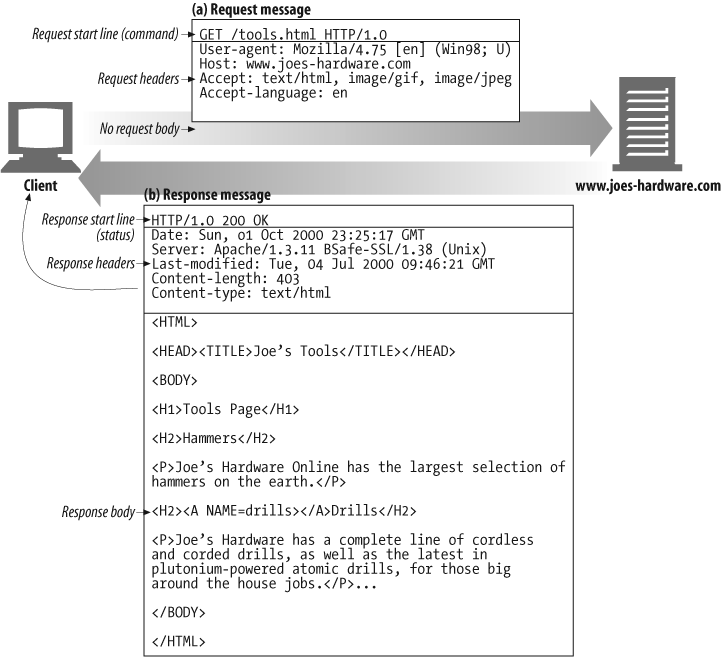

# Networking

## TCP/IP

In order to understand better what is the TCP/IP protocol and why it is important in World Wide Web(WWW), let's take a step back and understand a model named **Open Systems Interconnection(OSI)** which characterises and standardises communication between computing systems without regard to their underlying internal structure and technology. The goal of this model is to ensure inter-communication of diverse systems with a set of standard protocols.

A **protocol** in computer networking is a set of rules established for transmitting data between electronic devices such as computers. In order for two machines to communicate, there must be a preexisting agreement as to how the information will be structured and how each side will send and receive it.

### Open Systems Interconnection(OSI)

OSI model is nothing but a logical representation of how network systems are supposed to send data(or communicate) to each other. The model breaks down this communication procedure into different components(also called as layers). In total there are seven layers which communicate with the layer next to it and together make up the OSI model.

**7. Application Layer**

This is the layer which user interacts with and is responsible of providing network services to end-user applications. For example, in a web browser application, the HTTP protocol packages the data needed to send and receive web content. Some of the common Application Layer protocols are HyperText Transfer Protocol(HTTP), File Transfer Protocol(FTP) and Simple Mail Transfer Protocol(SMTP).

**6. Presentation Layer**

Request data flows from Application layer to Presentation layer which operates at the Operating System(OS) level with the data. At the sender level, this layer is responsible of converting application data into a format which can be consumed by every distinct network entity, encryption and compression of data. At the receiver side, the same layer is responsible for decrypting incoming data and converting it back to an application level format which can be understood by the client at Application Layer

**5. Session Layer**

This layer has the job of maintaining proper communication between two computer systems by establishing, managing and terminating sessions. A session refers to any interactive data exchange between two entities within a network. Other responsibilities of this layer is to re-establish session activities, authentication and authorization of communication between apps and servers etc.

**4. Transport Layer**

This layer has a very important job as its responsibility is to ensure complete and reliable delivery of data packets. It decides how much information should be sent at a time, recovery process in case of an error, support for re-transmission etc. Through these activities, it keeps a track of data packets being sent, check for errors, duplication and resend information if there is a failed delivery.

The most common Transport Layer protocol that we are aware of is TCP(Transmission Control Protocol). It ensures that a message inteded for a specific program running on a computer is delivered correctly(it uses port numbers to identify the program). Another common protocol is UDP(User Datagram Protocol). One major difference between TCP and UDP is that TCP is more secure that is ensuring a data packet inteded for a program is delivered safely while UDP doesn't guarantee that. However, UDP provides more speed over TCP in exchange of security. A common use case of UDP would be Voice-over IP(VoIP), Skype calls or live streaming.

**3. Network Layer**

This is the layer where magic of Internet occurs. Using this layer, we can reach out to a computer across the world without needing to know its actual location. Main job of this layer is to move packets from source to destination and is the layer routers operate on. It's responsible for routing data via the best physical path available based on a range of factors such as traffic controls, congestion of data packets, priority of service etc. At the receiving end, this layer is responsible of converting data packets to a format understood by Transport Layer.

Most common Network Layer protocol known to us is Internet Protocol(IPv4 and IPv6). It makes use of IP addresses which is a unique identifier for each machine on the Internet. You can think of IP addresses as unique licence plate numbers for vehicles.

**2. Data Link Layer**

This is a hardware layer protocol and is harder to understand but is mostly concerned with data transmission between nodes(machines) within a network and manages connections between physically connected devices such as switches. It is responsible for moving data into and out of a physical link in a network of systems.

**1. Physical Layer**

This is the final layer in networking where the real transmission of data bits takes place through a physical medium. At this layer, data is transmitted using type of signaling supported by the physical medium such as electric signals, optic signals(optical fiber, laser), radio frequencies or pulses of Infrared.

Now that we are aware of the OSI model and different layers in a networking model, let's take a look at a page request initiated from our web browser.

#### Example

When I request a page `https://www.facebook.com`, the browser resolves server name of the URL(**www.facebook.com**) into an IP address using the Domain Name System(DNS). DNS helps in providing a human readable and understandable address to a machine instead of the numerical IP address. This lookup returns an IP address something like 203.0.113.4. Browser then requests the resource from Facebook by sending an HTTP request across the Internet(using TCP as Transport layer and IP as Network layer protocol) to the computer at that IP address. In TCP networks, a port is an endpoint to a logical connection with the server. For HTTP traffic over TCP/IP, port number 80 is a reserved number. For example, while running an app locally, if you type `http://localhost`, browser would automatically try to connect to this application on port 80. Similarly, port 443 is the default port number for HTTPS traffic. Which means `https://www.facebook.com` would connect to port 443 on the machine which serves us Facebook.

## Ports

In computer networking, a port is a communication endpoint. From a software level's perspective, a port is a logical construct that identifies a specific process within an operating system. A computer makes its services available to the Internet using numbered ports(one for each service available on the machine).

In the domain of World Wide Web, a web server would typically be available on port 80(or 8000). This means that if the server is not protected by a firewall, anyone can connect to this port and use the service. Similarly, a secure Web server(HTTPS) is typically available on port 443.

Important point to note is that there is no hard rule which forces to use port 80 for a web server. One can opt any available port number but in that case, if a client wishes to connect to the server through say a browser, they would have to explicitly mention the port number they wish to connect to i.e http://aaa.bbb.ccc:3000. Otherwise, the browser simply assumes that the server is using the standard port 80.

## HTTP

Hyper Text Transfer Protocol(HTTP) as we saw above is an application layer protocol designed to exchange information over World Wide Web(WWW). It relies on few basic concepts like notion of resources and Uniform Resource Identifiers(URIs), a simple structure of messages and a client-server structure for communication flow. Since it is a client-server protocol, **requests** are sent by clients(usually web browsers) and a **response** is constructed and sent back by the server.

### HTTP Messages

(Start line, Headers, Body)

HTTP "client" is a program(for example a web browser) that establishes a connection with a server for the purpose of sending one or more _HTTP Messages_. An HTTP "server" is a program(for example a NodeJS server, NGINX web server) that accepts the connection in order to serve requests with response messages. You as a web developer would very rarely create HTTP Messages yourselves. The web browser or the web server would do it for you.

HTTP Messages follow a standard format which consists of four parts:

1. Start Line
2. Block of headers
3. Blank line indicating end of header fields
4. Optional Message Body

#### Requests

- Start Line: Consists of three parts: HTTP Method(GET, PUT, POST etc), URL target of resource requested and the HTTP version.

- Headers: A key-value pair of metadata separated by a colon(:). Some of the common headers used are User-Agent, Content-Type and Content-Length.

- Optional Body: Not all requests require a message body. For example, fetch requests such as GET, OPTIONS or HEAD don't require one. On the other hand, POST or PUT requests require a message body in order for server to update some information.

#### Responses

- Start Line: Consists of three parts: HTTP Version, HTTP Status Code(200, 201, 400, 401 or 404) and a purely informational status text to help better understand the response such as(OK, Not Found etc).

- Headers: Similar to HTTP Request Message headers, they are a key-value pair of metadata separated by a colon(:).

- Optional Body: Not all responses contain a message body. For example, requests with status code 201(Created) or 204(No Content) do not contain a message body but a GET request would contain a message body with the fetched resource.

**Reference**:

- https://developer.mozilla.org/en-US/docs/Web/HTTP/Overview
- https://developer.mozilla.org/en-US/docs/Web/HTTP/Messages
